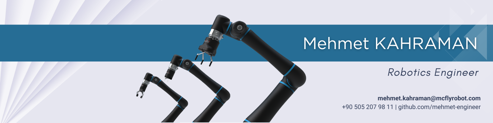

## Mehmet KAHRAMAN
**_Mechatronics and Robotics Software Engineer_**

_Mail: mehmet.kahraman@mcflyrobot.com_

  
  
  
  

 

 
<strong>I am Robotics Expert, Mechatronics and Control Software Engineer, ROS Developer</strong>

 
<strong>Linux User, Computer Vision Enthusiast, AI Researcher</strong>

As a R&D Robotic Software Engineer, with 4 years of experience, I specialize in robotics, computer science, and software development, offering innovative solutions to complex problems. My expertise covers a wide range of programming languages and tools, data analysis, AI techniques, and technical documentation. I completed my graduation thesis on AI supported ROS-based robotic arm with autonomous grasping ability. I gave lectures as an instructor on Udemy. I am currently working as a Robotic Software Engineer in a robot technologies company in the research and development department.

I am an advanced Python and C++ developer, Robotics expert, Control Software engineer, Linux user, Computer Vision enthusiast and Artificial Intelligence researcher.

I am interested in Robotics and Autonomous Systems such as Cobots, Manipulators, AGVs, Mobile Robots, and Rovers. Also, I have experience with Artificial Intelligence algorithms such as Machine Learning, Deep Learning, Reinforcement Learning and Computer Vision. In my scientific background, I am qualified in Kinematics, Dynamics, Linear Algebra, Control Theory, Probability, Sensor Fusion, Kalman Filters, Statistics, Data Science, Optimization, Genetic Algorithms and Image Processing.

---
### Languages

  
  
  

---
### Library and Platforms

  
  
  
  
  
  
  
  

  
  
  
  
  
  
  
  
  

---
### Areas of Interest
 - Robotics, Robotic Manipulators, Cobots, Mobile Robots, AGVs, Rovers, Autonomous Systems, 
 - Control Theory, Linear Control Systems, PID Control, Kinematics, Dynamics, Linear Algebra,
 - Sensor Fusion, Probability, Kalman Filters, Low Pass Filters,
 - Genetic Algorithms, Statistics, Data Science, Data Visualization, Image Processing,
 - Artificial Intelligence, Machine Learning, Deep Learning, Computer Vision, Convolutional Neural Networks.

### All My Skills
- Python, C++, CMake, Object Oriented Programming (OOP),
- ROS1, ROS2, Linux, Ubuntu, Docker, Git, Github,
- Jira Project Management, Scrum & Agile Methodologies,
- IPC Socket Programming, ZeroMQ, TCP and UNIX Sockets,
- ABB Robot Studio, Rapid, RoboDK, FlexSim, SprutCAM, ENCY,
- Universal Robot, TM Omron, Han's Robot programming,
- OpenCV, Pytorch, Tensorflow, Keras, Sci-kit learn, YOLO,
- Web Javascript, PyQT5, GUI and Desktop App Development, 
- Multithreading, Multitasking, Concurrency, Parallelism,
- Numpy, Pandas, Data Entry, Data Manipulation Libraries,
- Office Excel (advanced), Matplotlib, Data Visualization,
- MATLAB and Simulink, PID Control, Linear Control,
- Sensor Fusion, Kalman Filters, Low Pass Filters,
- Arduino, Raspberry Pi and Nvidia Jetson Nano Boards,
- EtherCAT and MODBUS.

### Contacts
 - Mail -> mehmet.kahraman@mcflyrobot.com
 - Linkedin -> https://www.linkedin.com/in/mehmet-kahraman-robotics-engineer
 - Github -> https://github.com/mehmet-engineer
 - Fiverr -> https://www.fiverr.com/mehmetengineer
 - Udemy -> https://www.udemy.com/user/mehmet-kahraman-38
 - Kariyer Net -> https://www.kariyer.net/ozgecmis/mehmetkahraman2000
