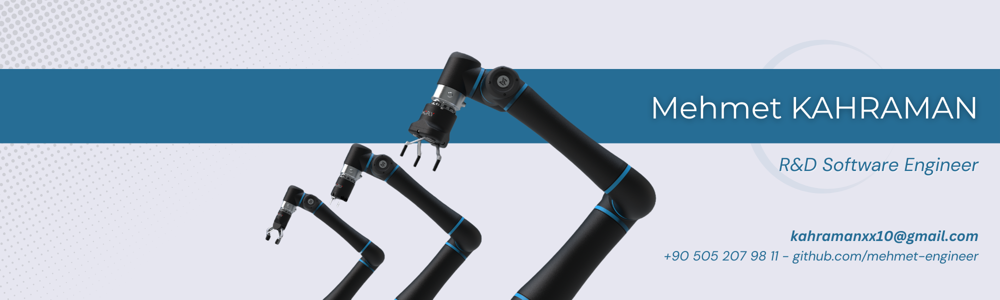

## Mehmet KAHRAMAN
**_Robotics and R&D Software Engineer_**

_Mail: kahramanxx10@gmail.com_

  
  
  

 

As a R&D Software Engineer, with 4 years of experience, I specialize in robotics, computer science, software development, and autonomous systems, offering innovative solutions to complex problems. I have contributed to a wide range of research-driven engineering projects. My background uniquely combines algorithmic programming, real-time system design, AI integration, and scientific problem-solving, making me a strong fit for advanced R&D environments.

I have built a strong background in Python, C++, and MATLAB, with a strong command of Object-Oriented Programming, algorithm design, and software architecture. Throughout my career, I have developed modular and scalable software solutions for autonomous systems and intelligent control systems. I prioritize efficient and high-performance programming using multithreading and inter-process communication. I have complemented these skills with experience using Git/GitHub, Linux/Ubuntu, and modern development workflows, allowing me to design, build, and maintain robust software infrastructures.

My professional experience includes intensive work with ROS1 and ROS2, robot control tools, and autonomous systems development. I have designed ROS-based software packages, deployed custom robotic applications, and integrated perception, motion planning, and control algorithms into real-world systems. I have also contributed to human-robot collaboration projects, cobots and mobile robots. In addition, I have hands-on experience with GUI and human–machine interaction applications, developing user-friendly tools that enhance system operability and visualization.

My scientific and technical background is supported by a strong foundation in kinematics, dynamics, linear algebra, control theory, and statistics. This scientific mindset has allowed me to approach engineering problems analytically and design mathematically sound solutions. I have applied these principles to real-world robotic systems, AI-driven simulations, and advanced control mechanisms. In the fields of AI, Deep Learning, Reinforcement Learning, and Computer Vision, I have worked on developing intelligent control strategies, perception algorithms, and autonomous decision-making systems. I follow modern AI trends closely and apply them to engineering tasks.

Beyond my expertise in software, I am experienced in Agile and Scrum methodologies, Jira-based project management, and collaborative R&D processes. My background includes technical documentation, researching papers, patent draft preparation, academic-level reporting, and delivering modern presentations.

I am interested in Robotics and Autonomous Systems such as Cobots, Manipulators, AGVs, Mobile Robots, and Rovers. Also, I have experience with Artificial Intelligence algorithms such as Machine Learning, Deep Learning, Reinforcement Learning and Computer Vision. In my scientific background, I am qualified in Kinematics, Dynamics, Linear Algebra, Control Theory, Probability, Sensor Fusion, Kalman Filters, Statistics, Data Science, Optimization, Genetic Algorithms and Image Processing.

---
### Languages

  
  
  

---
### Areas of Interest
 - Robotics, Robotic Manipulators, Cobots, Humanoid Robots, Mobile Robots, AGVs, Autonomous Systems, 
 - Control Theory, Linear Control Systems, PID Control, Kinematics, Dynamics, Linear Algebra,
 - Sensor Fusion, Probability, Kalman Filters, Low Pass Filters,
 - Genetic Algorithms, Statistics, Data Science, Data Visualization, Image Processing,
 - Artificial Intelligence, Machine Learning, Deep Learning, Reinforcement Learning, Computer Vision.

### All My Skills
- Python, C++, CMake, Object Oriented Programming (OOP),
- ROS1, ROS2, Linux, Ubuntu, Docker, Git, Github,
- Jira Project Management, Scrum & Agile Methodologies,
- IPC Socket Programming, ZeroMQ, TCP and UNIX Sockets,
- ABB Robot Studio, Rapid, RoboDK, FlexSim, SprutCAM, ENCY,
- Robot Visualization, RViz, Vista, VTK,
- Universal Robot, TM Omron, Han's Robot programming,
- ZED 2 Stereo Depth Camera, Depth Sensing, Point Cloud processing,
- OpenCV, Pytorch, Tensorflow, Keras, Sci-kit learn,
- YOLO Object Detection, Segmentation, Object Tracking,
- Web Javascript, PyQT5, GUI and Desktop App Development, 
- Multithreading, Multitasking, Concurrency, Parallelism,
- Numpy, Pandas, Data Entry, Data Manipulation Libraries,
- Microsoft Office Excel, Matplotlib, Data Visualization,
- MATLAB and Simulink, PID Control, Linear Control,
- Sensor Fusion, Kalman Filters, Low Pass Filters,
- Arduino, Raspberry Pi and Nvidia Jetson Nano Boards,
- Industrial Communications, EtherCAT and MODBUS.

### Contacts
 - Mail -> kahramanxx10@gmail.com
 - Linkedin -> linkedin.com/in/mehmet-kahraman-robotics-engineer
 - Github -> github.com/mehmet-engineer
 - Udemy -> udemy.com/user/mehmet-kahraman-38
